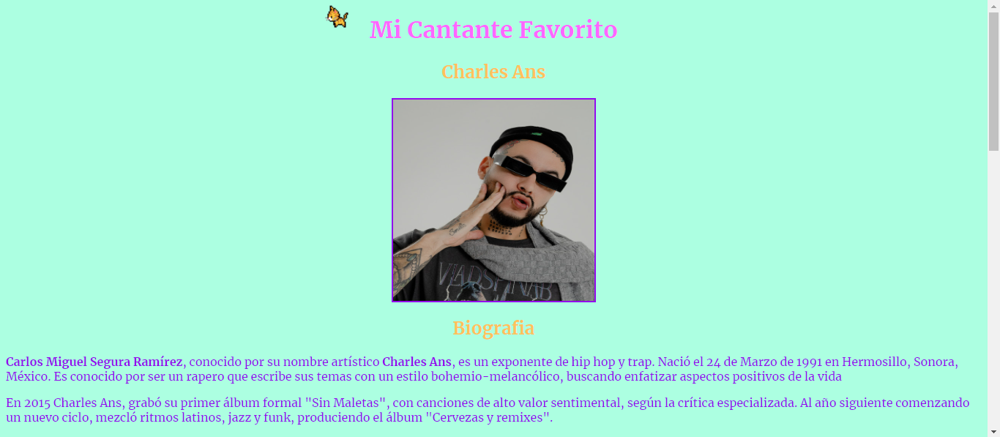

# Mi Cantante Favorito

Este proyecto es mi primer sitio Web elaborado con mis conocimientos básicos en HTML y CSS. El cual describe a mi cantante favorito e incluye un poco sobre su Biografía y su Discografía a lo largo de su carrera musical.

  ### Tecnologías Utilizadas
  + **HTML5:** Para la estructura básica del sitio.
  + **CSS3:** Para el diseño y estilo.

 
  ### Vista Previa del Proyecto
  

  ### Licencia
  Distribuido bajo la Licencia MIT. Consulta `LICENSE` para obtener más información.

  ### Elaboró:
  Johana Diaz: [Mi Linkedin](www.linkedin.com/in/johana-diaz-galván-22905b255)
